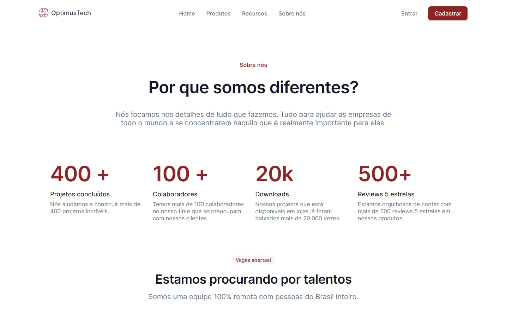

# #7DaysOfCode - OptimusTech

Projeto desenvolvido no desafio #7daysofcode idealizado por Giovanna Moeller em parceria com a Alura, uma empresa de educação em tecnologia.

[📎 Clicando aqui você pode acessar esse projeto!](https://bfalconi.github.io/7daysofcode)

## 💻 Tecnologias

- HTML
- CSS

## 📝 Projeto

É um projeto que apresenta a construção de uma página da empresa denominada OptimusTech a partir de um layout fornecido no Figma, utilizando as tecnologias HTML e CSS. Em um futuro próximo pretendo ir além do desafio proposto, adicionando responsividade e melhorias para a página, tornando-a mais acessível.

## 💻 Layout

Você pode visualizar o layout base do projeto através desse [link](https://www.figma.com/file/mm3MLozvUDGhDRTxSLlGL5/7daysOfCode-HTML-CSS?node-id=0%3A1&t=JIiovw3ABSWaxnr5-0). É necessário ter conta no Figma para acessá-lo.

## 📩 Contato

dgabrielfalconi@gmail.com
